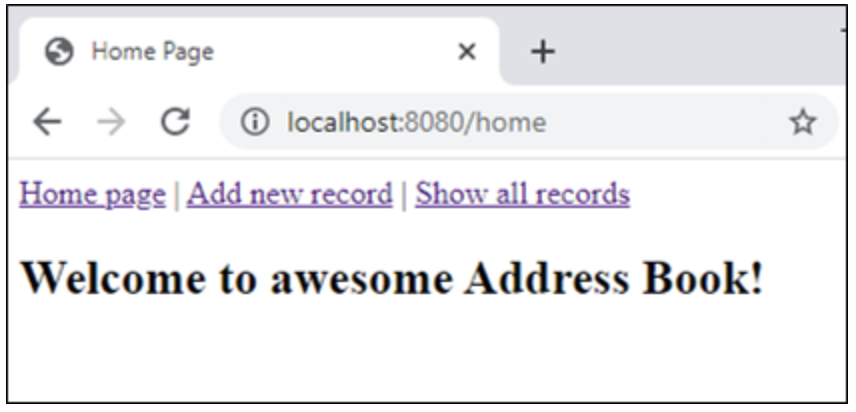
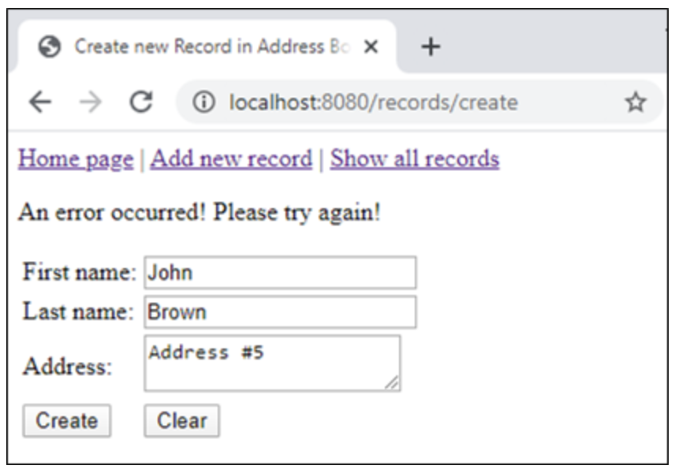
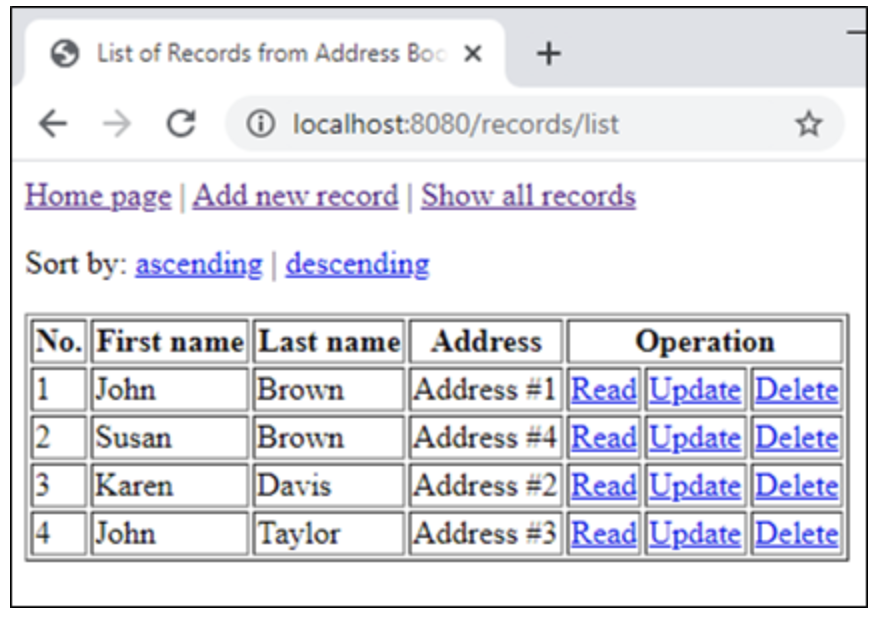
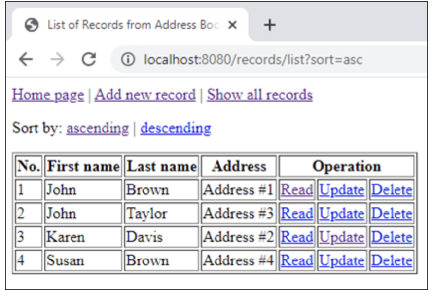
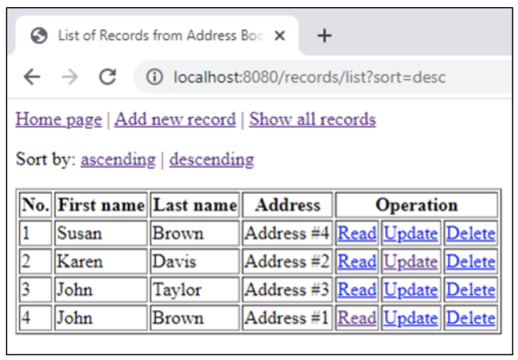
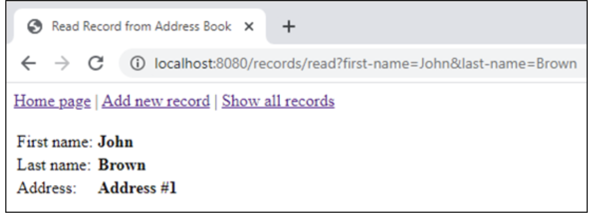
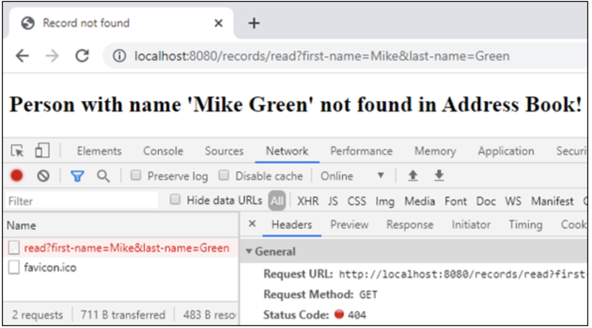
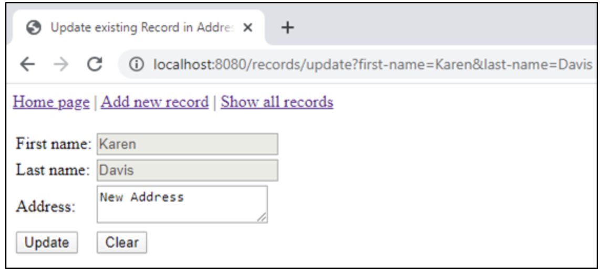
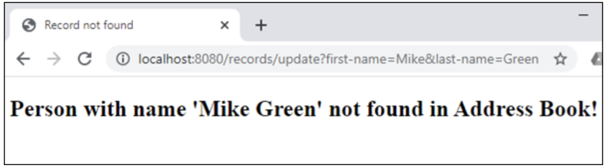
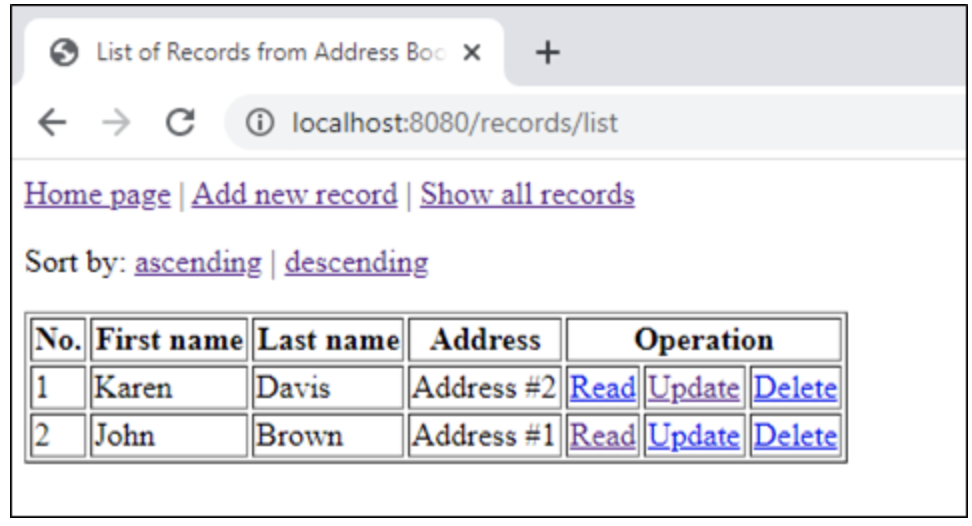

The working code of the Address Book from the Sprint #7 you can download here: https://github.com/demchyna/AddressBook.git

For your project you can use Servlet API, JSP, HTML and CSS.

**Created Web Application should be able to:**

1. Create a record in the Address Book.
2. View info about the record from the Address Book.
3. Edit the record from the Address Book.
4. Delete the record from the Address Book.
5. View all records from the Address Book.
6. Sort records from the Address Book by ascending or descending.
7. For all given above operations should be used a Web Interface.

The below given list of all routes and examples of pages:

1. Route `http://<host-name:port>/home`

Home page with references to other pages.

2. Route `http://<host-name:port>/records/create`

The page for adding a new records to the Address Book.

If a record with a given key already exists in the Address Book, then make redirect to the same page and display info about error.

3. Route `http://<host-name:port>/records/list`

Page with all records from Address Book organized in a table and hyperlinks buttons for sorting, viewing, editing and deleting records.

The sort order is determined by one of two possible values (asc / desc) of the 'sort' request parameter.

The 'ascending' button sorts by ascending first by first name and then by last name in the Address Book and the table.

The 'descending' button sorts by descending first by first name and then by last name in the Address Book and the table.

4. Route `http://<host-name:port>/records/read?first-name=<firtst name>&last-name=<last name>`

The page for view info about record that correspond to key specified through the request parameters.

If the record with the given key is not found in the Address Book, then make redirect to the error page and return the status code 404.

5. Route http://<host-name:port>/records/update?first-name=<firtst name>&last-name=<last name>

A page for edit an existing record that correspond to key specified through the request parameters.

If the record with the given key is not found in the Address Book, then make redirect to the error page and return the status code 404.

6. Route `http://<host-name:port>/records/delete?first-name=<firtst name>&last-name=<last name>`

The 'Delete' button deletes the record that correspond to key specified through the request parameters from Address Book and the table.

*** Forbidden to use pure JavaScript and JavaScript libraries like jQuery.**

*** All pages should be contains a valid HTML and CSS code.**
